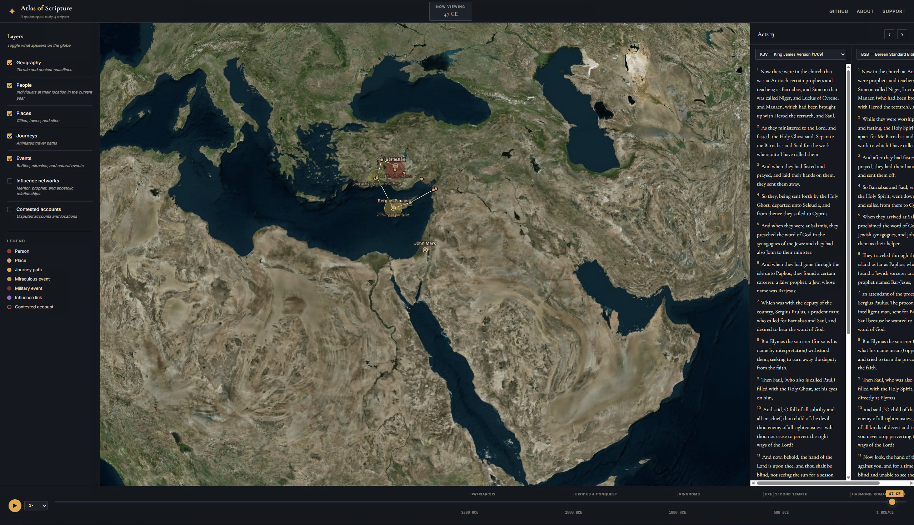

# Atlas of Scripture

> A spatiotemporal atlas of the Bible

**Atlas of Scripture** is an open-source interactive 3D globe for exploring the people, places, events, and journeys of scripture across time. It includes a synchronized side-by-side translation reader, a timeline scrubber that animates the world as it changes, and explicit support for showing where biblical accounts conflict or scholars disagree.



It's a study tool *and* an academic resource. It treats scholarly disagreement and textual contention as first-class features rather than papering over them.

- **Website:** https://atlasofscripture.org
- **GitHub:** https://github.com/atlasofscripture
- **Status:** Phase 0 — Scaffold

## Vision

The Bible is fundamentally a story rooted in real geography, real time, and real human relationships. Existing Bible tools tend to focus narrowly on either text, genealogy, or geography in isolation. Atlas of Scripture combines them.

The interface centers on a 3D globe (CesiumJS) with toggleable semantic layers:

- **Geographic layer** — terrain, ancient coastlines, shifting political borders
- **People layer** — individuals' birthplaces, residences, and death locations
- **Journey layer** — animated travel paths (Abraham, the Exodus, Paul's missions, the Diaspora)
- **Event layer** — natural events, miraculous events, wars, covenants
- **Influence layer** — mentor/disciple chains, prophetic reach, apostolic networks
- **Contention layer** — places and moments where accounts conflict, with each view explorable

A timeline scrubber drives all of this. Push it forward and watch empires rise and fall, journeys unfold, and influence networks bloom outward.

A synchronized side-by-side scripture reader stays anchored to the same moment shown on the globe.

## Project Status

**Phase 0 — Scaffold.** This is the initial scaffold. The architecture is laid out, the data schemas are defined, sample data is provided for one well-defined slice (Paul's first missionary journey, ~46–48 CE), and the core UI shell is in place. The vision is much larger than what's currently implemented; see `docs/roadmap/phases.md` for what comes next.

## Quick Start

```bash
# Clone
git clone https://github.com/atlasofscripture/atlas.git
cd atlas

# Install dependencies
npm install

# Get a free Cesium ion token from https://ion.cesium.com/
# and add it to .env (see .env.example)
cp .env.example .env

# Run the development server
npm run dev
```

Open http://localhost:5173 in your browser.

## Project Structure

```
atlas/
├── src/                  Application source
│   ├── components/       UI components (globe, reader, timeline, etc.)
│   ├── layers/           Globe layer modules (people, journeys, events, ...)
│   ├── store/            State management
│   ├── api/              Data loaders and translation API integrations
│   ├── utils/            Helpers (time, geo, citations)
│   └── styles/           CSS
├── data/                 The actual biblical knowledge data
│   ├── people/           Person entities (YAML)
│   ├── places/           Place entities
│   ├── events/           Event entities
│   ├── journeys/         Travel paths
│   ├── relationships/    Edges between entities
│   ├── translations/     Bible translation metadata
│   └── sources/          Citations (scholars, manuscripts, traditions)
├── docs/                 Documentation
│   ├── architecture/     How the system works
│   ├── contributing/     How to help
│   └── roadmap/          What comes next
├── scripts/              Data validation, build helpers
└── public/               Static assets
```

## Why Open Source

This project takes scholarly trust seriously. Open source is the right model because:

- Bible scholarship is communal — pastors, seminary students, archaeologists, and language scholars all have something to contribute.
- Transparency builds trust. When the contention layer shows disputed material, anyone can verify the methodology.
- No single tradition owns it. Catholic, Protestant, Orthodox, Jewish, and secular contributors are all welcome.
- Sustainability without monetization pressure means academic integrity is never compromised for revenue.

Every claim in the data is required to have a citation. See `docs/contributing/data-conventions.md`.

## Translations

The project uses freely-licensed and public-domain translations directly:

- King James Version (KJV)
- American Standard Version (ASV)
- World English Bible (WEB)
- Berean Standard Bible (BSB)
- Young's Literal Translation (YLT)

Copyrighted translations (NIV, ESV, NASB, NRSV, etc.) are not redistributed. They can be accessed through API integrations where users supply their own keys (see `src/api/translations/`).

## Contributing

See `docs/contributing/CONTRIBUTING.md`. The TL;DR:

- Data lives in version control as YAML files. Submit corrections and additions as pull requests.
- Every claim needs a source citation.
- Confidence levels are first-class: `consensus`, `majority`, `disputed`, `minority`, `speculative`.
- Disagreement is fine. Document it in the contention layer rather than picking a winner.

## License

- **Code:** MIT
- **Data:** CC BY-SA 4.0
- **Bundled translations:** public domain

See `LICENSE` for details.

## Maintainer

Created and maintained by [cwdaniel]. Open to contributors.

## Support

If this project is useful to you, consider sponsoring its development:

- GitHub Sponsors: *(link after launch)*
- Open Collective: *(link after launch)*
- Ko-fi: *(link after launch)*
